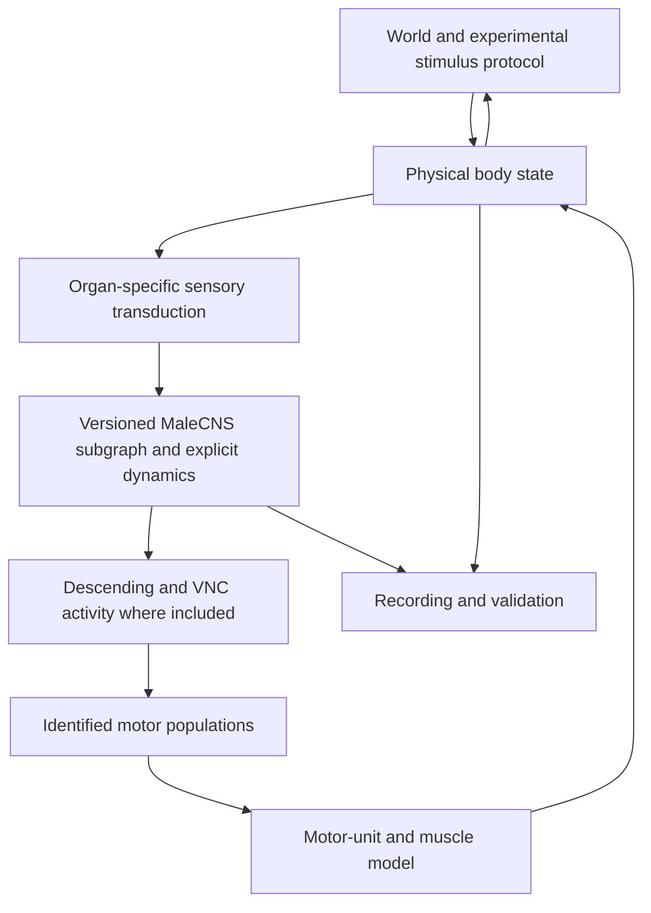

# Digital Fly feasibility: MaleCNS structure, biological constraints, and missing physiology

Research audit: 27 September 2026. Dataset: **MaleCNS v1.0**, released 8 June 2026. Scope: the five official files already downloaded by this project, fresh graph queries, read-only performance measurements, and primary research. **No Digital Fly implementation, application changes, dynamics changes, or commit.**

## 1. Executive summary

**Go for a bounded, explicitly parameterized sensorimotor experiment. No-go for claiming an executable, biologically accurate male fly from connectivity alone.**

The verified selection contains **166,606 neurons, 25,574,615 directed neuron-pair connections, and 124,144,950 underlying contacts**. Actual graph queries establish paths through sensory, ascending, brain-intrinsic, descending, VNC-intrinsic, and leg-motor neurons. These are structural paths, not measured signal propagation or demonstrated walking circuits.

The strongest maximum-bottleneck witness in our six-hop tactile-to-motor template is:

`909157 SNta33 → 800098 IN05B010 → 514660 AN09B003 → 13215 GNG512 → 230783 DNg97 → 800286 INXXX464 → 800061 Tergopleural/Pleural promotor MN`

It has **7 neurons, 6 edges, 899 contacts**, with individual weights **116, 106, 189, 159, 138, 191**. Its surrounding qualifying route union at ≥5 contacts per edge has **20,366 neurons, 284,057 unique edges, 5,902,011 contacts**. This is the strongest witness under that specified structural criterion, not a claim that this is the dominant biological reflex.

Motor annotations support much more specific endpoints than DNa02→LEFT/RIGHT: **381 leg motor neurons**, with leg and side assignments and several explicit muscle-function names. Sensory annotations also contain **33 explicit FeCO claw/hook/club synonyms**, all in the right hind-leg entry-nerve population. The decisive gaps are calibrated sensory transduction, functional synaptic effects, intrinsic neural properties, neuromodulatory state, muscle recruitment/forces, and body mechanics. A focused joint-response experiment is a more defensible first step than a six-legged walking demonstration.

## 2. Research question

Can behavior generated by a **computational model constrained by MaleCNS structure and external physiology** reproduce held-out Drosophila response statistics? This is different from predicting what the particular reconstructed animal would definitely do.

Evidence labels used here:

| Label | Meaning |
|---|---|
| DIRECT DATA | Present in the inspected release files; annotations remain annotations, not independent functional proof. |
| DOCUMENTED BIOLOGY | Supported by identified primary experiments; specimen, sex, and preparation may differ. |
| INFERENCE | Interpretation or graph-derived candidate, with selection rules stated. |
| ENGINEERING ASSUMPTION | An explicit future modeling choice, never silently filled in for missing biology. |
| UNKNOWN | Not established for the relevant MaleCNS cells or experiment. |

The future experiment must have **no rescue task, reward, destination, coverage objective, reinforcement learning, scripted exploration, prescribed gait, or hidden turn/escape heuristic**. A stimulus protocol is permissible; it describes the world, not a desired movement. Silence, immobility, oscillation, instability, or falling are outcomes to record, not failures to conceal with a fallback navigator.

## 3. MaleCNS data audit

### Provenance and reproducibility

Sources are the [official release/download resources][S1], with the [2026 Cell publication][S2]. Release is `male-cns:v1.0`, license **CC BY 4.0**. Fresh loading used the existing immutable loader and verified the stored source checksums. Exact URLs, byte sizes, generations, SHA-256 hashes, loader checks, and discrepancies are preserved in `DIGITAL_FLY_LOAD.json`.

| Role / exact filename | Source URL | Verified bytes |
| --- | --- | --- |
| annotations: `body-annotations-male-cns-v1.0-minconf-0.5.feather` | [Official file](https://storage.googleapis.com/flyem-male-cns/v1.0/connectome-data/flat-connectome/body-annotations-male-cns-v1.0-minconf-0.5.feather) | 14,483,314 |
| neurotransmitters: `body-neurotransmitters-male-cns-v1.0.feather` | [Official file](https://storage.googleapis.com/flyem-male-cns/v1.0/connectome-data/flat-connectome/body-neurotransmitters-male-cns-v1.0.feather) | 43,282,834 |
| body_stats: `body-stats-male-cns-v1.0-minconf-0.5.feather` | [Official file](https://storage.googleapis.com/flyem-male-cns/v1.0/connectome-data/flat-connectome/body-stats-male-cns-v1.0-minconf-0.5.feather) | 778,062,826 |
| edges: `connectome-weights-male-cns-v1.0-minconf-0.5.feather` | [Official file](https://storage.googleapis.com/flyem-male-cns/v1.0/connectome-data/flat-connectome/connectome-weights-male-cns-v1.0-minconf-0.5.feather) | 1,051,241,946 |
| metadata: `Neuprint_Meta_debug.json` | [Official file](https://storage.googleapis.com/flyem-male-cns/v1.0/database/neuprint-inputs/Neuprint_Meta_debug.json) | 1,747,811 |

The selected graph retains nonempty `superclass` values excluding those containing `tbc`; it does **not** require a particular proofreading status or a non-null cell type. This selects 166,606 of 211,577 annotation records, excluding 44,971. The source connectivity file contains 151,856,684 segment-pair rows and 311,833,243 contacts; keeping only selected endpoints retains 25,574,615 rows and 124,144,950 contacts. No selected duplicate pairs required coalescing. There are **166,400 connected and 206 isolated selected neurons**.

Global body statistics and official metadata agree exactly on **45,656,140 presynaptic sites** and **311,833,243 postsynaptic contacts**. A presynaptic site can have multiple postsynaptic partners: these totals describe different quantities. The authors' older **v0.9** notebook has 166,391 connected neurons, 25,563,426 edges and 20 superclasses; our v1.0 deltas are **+9, +11,189 and +1**, respectively. Those are reported version differences, not failed same-version invariants. The rounded published “167k” description is not an exact validation target.

### Exact available fields

| File | Fields and physical Arrow types |
| --- | --- |
| annotations | `assignedOlHex1` (double); `assignedOlHex2` (double); `bodyId` (int64); `flywireType` (string); `group` (double); `instance` (string); `somaSide` (string); `statusLabel` (dictionary<values=string, indices=int8, ordered=1>); `superclass` (string); `type` (string); `vfbId` (string); `hemibrainType` (string); `itoleeHl` (string); `supertype` (string); `birthtime` (string); `mancBodyid` (double); `mancGroup` (double); `mancType` (string); `subclass` (string); `synonyms` (string); `class` (string); `rootSide` (string); `somaNeuromere` (string); `trumanHl` (string); `dimorphism` (string); `matchingNotes` (string); `entryNerve` (string); `mancSerial` (double); `mcnsSerial` (double); `serialMotif` (string); `fruDsx` (string); `exitNerve` (string); `receptorType` (string); `somaLocation` (list<item: int64>); `tosomaLocation` (list<item: int64>); `status` (string) |
| neurotransmitters | `body` (int64); `cell_type` (string); `total_nt_predictions` (int32); `predicted_nt_confidence` (double); `predicted_nt` (string); `ground_truth` (string); `celltype_total_nt_predictions` (int32); `celltype_predicted_nt` (string); `celltype_predicted_nt_confidence` (double); `consensus_nt` (string) |
| body_stats | `body` (int64); `pre` (int32); `post` (int32); `status_fine` (dictionary<values=string, indices=int8, ordered=1>); `superclass` (string); `class` (string); `type` (string); `instance` (string); `downstream` (int64); `synweight` (int64); `rank` (int64) |
| edges | `body_pre` (int64); `body_post` (int64); `weight` (int64) |

The merged neuron table has **45 columns**: 36 annotation columns plus nine neurotransmitter columns after joining `body` to `bodyId`. The annotation `cell_type`-like counterpart in the transmitter file is `cell_type`, distinct from the curated `type`. IDs are dataset-specific identifiers, not universal cross-dataset keys. Numeric nullable `mancBodyid` values require checked integer conversion before joining.

Relevant field coverage:

| Field | Non-null selected records | Null selected records |
| --- | --- | --- |
| `type` | 164,503 | 2,103 |
| `class` | 26,512 | 140,094 |
| `subclass` | 21,929 | 144,677 |
| `instance` | 160,058 | 6,548 |
| `synonyms` | 3,954 | 162,652 |
| `rootSide` | 17,874 | 148,732 |
| `somaSide` | 148,692 | 17,914 |
| `somaNeuromere` | 21,796 | 144,810 |
| `entryNerve` | 11,774 | 154,832 |
| `exitNerve` | 1,005 | 165,601 |
| `mancBodyid` | 18,557 | 148,049 |
| `mancType` | 22,743 | 143,863 |
| `flywireType` | 143,154 | 23,452 |
| `somaLocation` | 139,659 | 26,947 |
| `tosomaLocation` | 995 | 165,611 |
| `assignedOlHex1` | 23,720 | 142,886 |
| `assignedOlHex2` | 23,720 | 142,886 |
| `receptorType` | 752 | 165,854 |
| `consensus_nt` | 166,440 | 166 |
| `ground_truth` | 85,484 | 81,122 |
| `predicted_nt_confidence` | 165,583 | 1,023 |

There are **11,751 distinct non-null `type` labels**. `class` is absent for 140,094 selected neurons; most neurons can still have a superclass and type. Fine status labels include 71,978 “Roughly traced,” 54,052 “Reviewed,” 36,362 “Prelim Roughly traced,” 2,017 “RT Hard to trace,” and 1,991 “Out of scope.” Thus, selection is not a certificate of equally complete proofreading.

Coordinates are partial: 139,659 `somaLocation` and 995 `tosomaLocation` records. Metadata specifies 8 nm voxels. Soma coordinates do not specify arbor, peripheral sensory location, muscle attachment, or conduction delay. `somaNeuromere`, nerve labels and global ROI descriptions are available; **the local edge table has no synapse coordinates, ROI, compartment, receptor, delay, or physiology fields**. Optic-lobe hex coordinates occur on 23,720 records, but do not by themselves define retinal optics.

Official resources additionally offer `syn-points-…feather` (~12.7 GB), `syn-partners-…feather` (~6.8 GB), `tbar-neurotransmitters-…feather` (~2.7 GB), and SWC skeletons. They were **not downloaded or audited here**. These could resolve synapse placement and morphology; they would not supply all electrical parameters. neuPrint programmatic queries require an account/token. Coordinate units vary by skeleton export and must be checked. [Official bulk resources][S1]

### Coverage is structural, not completeness

The actual graph supports the requested sequence of cell classes, including a brain-intrinsic stage in the six-hop example. However, the aggregate edges cannot prove where within an ascending/descending cell a synapse lies. Anatomical compartment confirmation needs per-synapse ROIs/skeletons. Missing peripheral axons, excluded fragments, unknown types and unequal proofreading remain material.

All 381 leg motors receive selected-graph input. At ≥5 contacts, only **374/381** are reachable within six hops from each of the five audited sensory seeds (tactile, proprioceptive, chordotonal, visual, olfactory). This is a bounded reachability result, not evidence that the remaining seven are disconnected at all thresholds. Some cells are sinks within the CNS graph; absent outgoing CNS edges do not imply absent neuromuscular junctions. No muscle nodes or NMJ geometry are supplied by the local files.

## 4. Sensory systems

Populations below use exact annotation filters. They are not exhaustive anatomical census estimates; they must not be summed indiscriminately, because chordotonal cells are nested within proprioception. Full IDs and per-population distributions are in `DIGITAL_FLY_AUDIT.json`.

| Exact population | Neurons | Sensory root sides | Outgoing edges / contacts into selected CNS |
| --- | --- | --- | --- |
| tactile | 2,558 | R: 1,294; L: 1,264 | 295,913 / 1,391,747 |
| head_mechanosensory | 1,733 | R: 895; L: 838 | 111,644 / 573,986 |
| proprioceptive | 1,453 | L: 734; R: 718; unknown: 1 | 179,048 / 1,002,904 |
| chordotonal | 425 | L: 221; R: 204 | 38,020 / 241,415 |
| visual | 6,091 | R: 3,746; L: 2,345 | 74,557 / 647,218 |
| olfactory | 2,639 | R: 1,344; L: 884; unknown: 411 | 229,857 / 1,350,065 |

Representative IDs, chosen as reproducible examples rather than functional exemplars: tactile **801756, 802409**; head mechanosensory **10438, 13670**; visual **11139, 15479**; olfactory **11151, 18147**. Each record's type and connectivity can be queried using the audit JSON. `rootSide` is used for sensory laterality; missing soma locations must not be filled with a fabricated sensory soma side.

**Tactile/mechanosensory.** The 2,558 `mechanosensory_tactile` cells include the existing 266 ProLN tactile inputs. Another 1,733 `cb_sensory` cells have `class=mechanosensory`, including Johnston's-organ and bristle-related types; they are a separate population, not all leg touch sensors. Nerve/type annotations support candidate organ assignments, but not a complete body-surface receptive-field atlas, contact-force sensitivity, directional tuning, adaptation or firing-rate function. A virtual ray is not a biological bristle. A future model would need an identified bristle/antenna location, contact deformation, and a published transduction constraint before selecting its input cells.

**Vision.** The strict `class=visual` set has 6,091 cells, including R1–R6 and R7/R8 variants, all with histamine consensus labels. Additional `ol_intrinsic` (89,403), visual projection (9,201) and centrifugal (563) populations demonstrate downstream coverage; they are not additional photoreceptors. Retinotopy is partially annotated. Optical sampling, spectral response, adaptation and stimulus-to-current conversion remain external/model requirements. A light-left/light-right experiment cannot be claimed from hemisphere-wide arbitrary injection.

**Olfaction.** The 2,639 `class=olfactory` cells include glomerular labels such as ORN_DA1, ORN_VA1d and ORN_VA1v; all have acetylcholine consensus labels. This permits candidate glomerular population mapping. It does not supply an odorant concentration→receptor→firing calibration, antennal airflow, plume sampling or adaptation. `receptorType` in the neuron table contains putative ppk/IR sensory labels; **it is not a postsynaptic neurotransmitter-receptor map**.

**Input feasibility:** biological sensory organs can replace abstract rays in a future model, but only at the resolution for which location, modality and transduction are documented. Treat unsupported organ-to-cell assignments as UNKNOWN until explicitly parameterized. The most concrete existing evidence is the proprioceptive subset below.

## 5. Proprioception

The actual **1,453** `mechanosensory_proprioceptive` cells are **not 1,453 chordotonal cells**. Their subclasses are:

| Subclass | Count |
|---|---:|
| Campaniform sensilla | 426 |
| Chordotonal organ | 425 |
| Haltere | 201 |
| Leg, without the finer labels above | 190 |
| Hair plate | 113 |
| Abdomen | 66 |
| Wing | 19 |
| Notum | 12 |
| Neck | 1 |

There are 734 root-left, 718 root-right and one unknown-side proprioceptive cells. Their superclasses are 1,030 `vnc_sensory` and 423 `sensory_ascending`. Consensus NT is acetylcholine for 1,431, serotonin for 16 and unclear for six; do not silently overwrite unusual labels.

The **425 chordotonal** records comprise 221 left and 204 right. Entry nerves: **ProLN 36** (23 L/13 R), **MesoLN 163** (80 L/83 R), **MetaLN 193** (93 L/100 R), **ProCN 33**. Thus, the entire chordotonal subset should not be labeled “front-leg FeCO.” Nerve-level assignment does not establish complete peripheral coverage or every receptor's joint tuning.

### Explicit FeCO functional-family labels

Searching `synonyms` as well as `type` finds **13 FeCO claw, five FeCO hook, and 15 FeCO club records**. All 33 are annotated `entryNerve=MetaLN`, `rootSide=R`. An unrestricted word search finds additional “claw” matches elsewhere; those are not added to the proprioceptor population.

| Synonym | Count | Exact IDs |
| --- | --- | --- |
| FeCO claw | 13 | 808592, 809595, 810643, 810683, 812869, 813011, 813286, 818478, 822975, 903471, 908277, 908278, 912444 |
| FeCO hook | 5 | 812228, 812848, 819524, 819559, 907742 |
| FeCO club | 15 | 807459, 809375, 810876, 810980, 811516, 811918, 812659, 814658, 815864, 815949, 817331, 905526, 905633, 908862, 936153 |

These are direct annotation matches. Other cells with the same SNpp type but absent synonyms are candidates for a reviewed type-level mapping, not additional independently annotated examples. In particular, the promising front-left cell **815843/SNpp51** has no FeCO synonym in its own record.

External work distinguishes position-sensitive claw, direction-sensitive hook, and movement/vibration-related club channels, with different downstream routing. The detailed FANC/FlyWire reconstructions are female and not interchangeable with MaleCNS. Published subtype anatomy and datasets can constrain mapping, but do not assign a measured transfer function to every MaleCNS ID. [Lee et al., 2025][S3] State-dependent presynaptic suppression means proprioceptive feedback is not simply a constant joint-angle input. [Dallmann et al., 2025][S4]

### Actual downstream evidence

All proprioceptive cells together project **114,451 edges/671,065 contacts** to VNC-intrinsic cells, **27,905/166,037** to ascending neurons, **4,746/17,296** to descending neurons, **11,464/52,211** to brain-intrinsic cells, and **2,664/18,344** directly to leg motors. Chordotonal cells alone project **26,616/175,780** to VNC-intrinsic cells, **6,561/47,180** to ascending neurons, **285/928** to descending neurons and **946/4,788** directly to leg motors. These categories describe postsynaptic cells, not necessarily synapse locations.

Strongest aggregate chordotonal targets by contact count are **801069/INXXX007 (1,959)**, **800471/IN13A002 (1,943)**, **803257/INXXX007 (1,923)**, **800139/IN13A002 (1,736)**, and **801321/IN00A003 (1,683)**. Front-left chordotonal targets include **904707/IN13A006 (155)**, **801935/IN09A016 (131)**, **803488/IN23B024 (130)**, **803257/INXXX007 (126)** and **24974/AN09B015 (120)**. A large contact sum nominates a structural target; it does not prove the target's physiological importance.

## 6. Descending control

The selection contains **1,314 descending neurons**: soma sides 656 L, 648 R and 10 M; consensus NT 931 acetylcholine, 241 GABA, 104 glutamate, 36 unclear and two serotonin. Broader locomotor evidence is available, but not every named DN has a simple scalar movement interpretation.

| Population and actual MaleCNS IDs | Documented function or candidate role | Evidence boundary |
|---|---|---|
| DNa01: 10442, 10760; DNa02: 10360, 523769 | Distinct steering-related activity and timing/gain relationships | Physiology/perturbation evidence; neither is a universal wheel command. [Rayshubskiy et al.][S5] |
| DNg13: 11074, 512006; DNa02 above | Different multi-leg steering gestures, including outside-stride lengthening versus inside-stride shortening | Phase and walking context matter; converting either directly to yaw discards this mechanism. [Yang et al., 2024][S6] |
| DNp09: 10783, 11177 | Forward-walking command-like activation and recruitment of other descending neurons | Recruitment is distributed; context and activation protocol matter. [Braun et al., 2024][S7] |
| MDN: 10763, 11288, 11332, 12348 | Backward walking under activation | The identified cells are not a calibrated backward-speed actuator. [Braun et al., 2024][S7] |
| DNg97/oDN1: 13805, 230783; DNg100/BDN2: 10045, 10056 | Walking-promoting descending populations; BDN2 activity/perturbation relates to forward walking | Aliases are explicit in MaleCNS `synonyms`; context-specific function comes from physiology. [Sapkal et al., 2024][S8] |
| DNg60/BB: 11374, 188947 | Bluebell, a context-specific halting population | Explicit BB synonym; halting is not equivalent to setting velocity to zero. [Sapkal et al., 2024][S8] |
| AN19A018/BRK: 14113, 14863, 14973, 16542, 17510, 523843 | Brake-related ascending neurons associated with active arrest of stepping | These six are **ascending**, not descending; source anatomy and local annotation agree. [Sapkal et al., 2024][S8] |
| DNb08: 12044, 12075, 12189, 12550; DNg97/DNg100 above | Candidates for walking pattern generation and coordination pathways | A 2026 preprint identifies candidate CPG and inter-leg coupling circuitry; this is not a verified complete oscillator model for our specimen. [Sapkal et al., 2026 preprint][S9] |
| DNa03: 10975, 519624; DNa11: 10971, 11233; LAL013: 14674, 512258; LAL014: 12724, 519724; LAL015: 11054, 13201 | Candidate central steering/orientation circuitry | External circuit study is a preprint; LAL types are central, not DN outputs. [Feng et al., 2024 preprint][S10] |

Additional annotation inventory finds DNp07 (11513, 11704), DNp17 (12 IDs in the audit) and DNp18 (10026, 10048); this audit does not assign them walking functions merely from their names. Exact BPN, FG and MAN searches across type/synonym/cross-reference fields found no match; that means **unresolved correspondence**, not absence of the biological cells. The audit did find BB, BRK, oDN1 and BDN2 through synonyms despite zero exact type-name matches.

For speed, orientation and coordination, use measured multivariate responses and distributed circuitry. Do not invent a “speed neuron,” impose a desired heading, or reinterpret every descending asymmetry as a turn command.

## 7. VNC architecture

There are **13,161 VNC-intrinsic neurons**, with 5,544 acetylcholine, 5,318 GABA, 2,104 glutamate, 188 unclear, five missing and two histamine consensus labels. There are also 1,846 ascending neurons. Somatic T1/T2/T3, lineage/hemilineage, serial motif, type and cross-dataset fields can help organize candidate circuits; many entries are missing.

Using an explicit structural definition—`vnc_intrinsic` with at least one ≥5-contact edge directly onto a selected leg motor—finds **5,533 premotor candidates, 32,224 such edges and 889,627 contacts**. This is a derived set, not a dataset field or a list of physiologically proven premotor cells. IDs are saved in `DIGITAL_FLY_SUPPLEMENT.json`.

Local sensory→VNC→motor routes are abundant; forcing every response through the brain would remove real structural shortcuts. Conversely, pruning to a forward chain removes recurrent and presynaptic feedback. Published MANC analysis provides motor-system organization and cross-reference material, but it is a different reconstruction and release. [Cheong et al.][S11] Candidate rhythm-generating and coupling motifs must be checked against this graph and functional data before being assigned dynamics. [2026 coordination preprint][S9]

## 8. Motor neurons

There are **708 `vnc_motor` plus 107 `cb_motor` = 815 motor-annotated cells**. The following counts are directly re-measured:

| Group | Count | Laterality / qualification |
|---|---:|---|
| Front leg, `fl` | 135 | 68 soma-left / 67 soma-right |
| Middle leg, `ml` | 116 | 58 / 58 |
| Hind leg, `hl` | 130 | 66 / 64 |
| All selected leg motors | 381 | 192 / 189 |
| Wing, VNC `wm` | 67 | 33 / 34 |
| Haltere, VNC `hm` | 16 | Separate from wing |
| Neck, VNC `nm` | 24 | 12 / 12; plus 20 `cb_motor/nm` = 44 total neck labels |
| Abdomen, VNC `ad` | 214 | Not locomotor-leg outputs |
| Remaining VNC `xm` | 6 | Do not assign a function without the annotation glossary |
| Other brain motor subclasses | 67 `pm`, 13 `am`, 7 `rm` | Labels retained; not all mapped to a muscle by this audit |

**Muscle-related mapping is partially present, not absent.** Leg types include `Ti flexor MN` (37), `Ti extensor MN` (12), `Acc. ti flexor MN` (47), `Tr flexor MN` (35), `Acc. tr flexor MN` (22), `Sternal posterior rotator MN` (22), and others. These provide named tibia/trochanter and flexion/extension endpoints. They do not encode muscle attachment geometry, moment arms, motor-unit force, recruitment thresholds, joint limits or spike-to-force dynamics.

The front-left tibia subset illustrates the available granularity:

| Type | Count | Exact front-left IDs |
| --- | --- | --- |
| Ti flexor MN | 5 | 807165, 809912, 818057, 819384, 909831 |
| Acc. ti flexor MN | 10 | 806599, 815246, 816215, 816404, 817283, 819869, 825516, 867630, 903298, 1050115387 |
| Ti extensor MN | 2 | 800636, 815344 |

Cross-dataset joins need review: `mancBodyid` exists on 18,557 neurons but has only 18,146 distinct values. For example, MaleCNS **815246** (`Acc. ti flexor MN`) and **819384** (`Ti flexor MN`) both point to MANC **17885**. A naive one-to-one join would silently merge conflicting labels. Neither an SNpp type nor a MANC match should propagate a physiological identity without inspecting these cases.

Leg-motor consensus NT is **230 glutamate, 144 unclear, six acetylcholine and one missing**. The two front-left tibia extensors have `unclear` consensus. Anatomical motor identity does not authorize rewriting those records. External motor physiology supplies recruitment and force constraints for particular studied cells, not a universal force constant. [Azevedo et al., 2020][S12]

**Answer to the motor-output question: yes, structurally.** A future model can read named motor populations after VNC processing, instead of ending at DNa02. Biology-backed anatomy reaches named motor endpoints and some muscle functions. The conversion from simulated activity to activation, tension, torque and movement remains partly external physiology and partly explicit modeling. A motor neuron is not a joint position command.

## 9. Candidate sensory-to-motor chains

### Method and limits

The analysis uses sparse/vectorized operations and fixed stage templates of 2–6 directed hops. Forward/backward reachability identifies all edges lying on a complete **stage-constrained walk**. Repeated VNC stages can revisit a neuron; these are walk unions, not enumerated simple paths. The table counts unique neurons, unique directed edges and contacts once per edge, even if an edge appears at multiple stages. It does **not** count the number of possible paths.

Thresholds 1, 5 and 10 contacts are sensitivity settings, not probabilities of correctness. A maximum-bottleneck witness maximizes the smallest edge weight; deterministic ID ordering breaks ties. No exhaustive claim about all possible sensory→motor paths is made. An independent sparse-matrix implementation checks every reported union and verifies every witness edge against the cached verified graph.

| Template | Min contacts/edge | Hops | Neurons | Edges | Contacts | Source / target participants |
| --- | --- | --- | --- | --- | --- | --- |
| T → C/A → D → V → M | 1 | 4 | 12,121 | 314,546 | 2,686,251 | 2552 / 381 |
| T → C/A → D → V → M | 5 | 4 | 8,766 | 92,285 | 1,885,896 | 2433 / 373 |
| T → C/A → D → V → M | 10 | 4 | 6,275 | 40,461 | 1,288,119 | 2071 / 347 |
| T → V → A → C → D → V → M | 1 | 6 | 30,694 | 1,040,791 | 8,291,460 | 2558 / 381 |
| T → V → A → C → D → V → M | 5 | 6 | 20,366 | 284,057 | 5,902,011 | 2538 / 373 |
| T → V → A → C → D → V → M | 10 | 6 | 14,456 | 127,633 | 4,181,088 | 2413 / 347 |
| P → C/A → D → V → M | 1 | 4 | 13,170 | 360,483 | 3,086,209 | 1430 / 381 |
| P → C/A → D → V → M | 5 | 4 | 9,102 | 96,432 | 2,092,452 | 1270 / 373 |
| P → C/A → D → V → M | 10 | 4 | 6,305 | 43,127 | 1,458,476 | 1044 / 347 |
| P → V → M | 1 | 2 | 7,694 | 116,052 | 1,177,262 | 1451 / 381 |
| P → V → M | 5 | 2 | 4,362 | 29,631 | 736,756 | 1217 / 366 |
| P → V → M | 10 | 2 | 2,616 | 12,501 | 494,000 | 792 / 322 |
| Ch → V → V → M | 1 | 3 | 9,627 | 633,620 | 4,856,881 | 425 / 381 |
| Ch → V → V → M | 5 | 3 | 6,567 | 97,485 | 2,303,379 | 420 / 374 |
| Ch → V → V → M | 10 | 3 | 4,566 | 37,214 | 1,414,611 | 403 / 346 |
| Ch-FL → V → tibia-FL | 1 | 2 | 302 | 1,586 | 16,011 | 23 / 17 |
| Ch-FL → V → tibia-FL | 5 | 2 | 80 | 252 | 6,713 | 10 / 17 |
| Ch-FL → V → tibia-FL | 10 | 2 | 43 | 108 | 4,941 | 5 / 14 |
| P-FL → V → tibia-FL | 1 | 2 | 511 | 2,833 | 24,145 | 43 / 17 |
| P-FL → V → tibia-FL | 5 | 2 | 142 | 460 | 10,576 | 26 / 17 |
| P-FL → V → tibia-FL | 10 | 2 | 61 | 148 | 6,572 | 12 / 15 |
| Ch-FL → V → V → tibia-FL | 1 | 3 | 1,174 | 40,922 | 283,369 | 23 / 17 |
| Ch-FL → V → V → tibia-FL | 5 | 3 | 518 | 3,654 | 79,090 | 22 / 17 |
| Ch-FL → V → V → tibia-FL | 10 | 3 | 285 | 1,148 | 40,950 | 19 / 16 |
| T-ProLN → C/A → D → V → front-leg M | 1 | 4 | 3,800 | 90,502 | 733,724 | 261 / 135 |
| T-ProLN → C/A → D → V → front-leg M | 5 | 4 | 2,245 | 18,939 | 393,564 | 207 / 129 |
| T-ProLN → C/A → D → V → front-leg M | 10 | 4 | 1,266 | 6,510 | 225,717 | 102 / 119 |
| FeCO-HR → V → tibia-HR | 1 | 2 | 312 | 1,778 | 20,287 | 33 / 18 |
| FeCO-HR → V → tibia-HR | 5 | 2 | 109 | 437 | 12,119 | 24 / 17 |
| FeCO-HR → V → tibia-HR | 10 | 2 | 63 | 192 | 7,399 | 18 / 14 |
| FeCO-HR → V → V → tibia-HR | 1 | 3 | 1,301 | 48,589 | 389,374 | 33 / 18 |
| FeCO-HR → V → V → tibia-HR | 5 | 3 | 640 | 5,733 | 146,214 | 33 / 18 |
| FeCO-HR → V → V → tibia-HR | 10 | 3 | 356 | 1,783 | 69,549 | 33 / 15 |

Abbreviations: T=tactile; P=proprioceptive; Ch=chordotonal; V=VNC-intrinsic; A=ascending; C=brain-intrinsic; D=descending; M=leg motor. `C/A` means either brain-intrinsic or ascending, not an obligatory brain-intrinsic stage. FL/HR specify front-left/hind-right sensory and tibia motor restrictions. The six-hop route explicitly requires a brain-intrinsic intermediate.

| Template at ≥5 | Maximum-bottleneck witness IDs/types | Edge contacts | Bottleneck | Consensus NT along witness |
| --- | --- | --- | --- | --- |
| T → C/A → D → V → M | 804104 (SNta05) → 18050 (AN09B009) → 12089 (DNde006) → 801072 (IN07B012) → 802232 (Tr flexor MN) | 126/109/94/100 | 94 | acetylcholine → acetylcholine → glutamate → acetylcholine → glutamate |
| T → V → A → C → D → V → M | 909157 (SNta33) → 800098 (IN05B010) → 514660 (AN09B003) → 13215 (GNG512) → 230783 (DNg97) → 800286 (INXXX464) → 800061 (Tergopleural/Pleural promotor MN) | 116/106/189/159/138/191 | 106 | acetylcholine → gaba → acetylcholine → acetylcholine → acetylcholine → acetylcholine → glutamate |
| P → C/A → D → V → M | 801906 (SNpp31) → 47659 (AN05B096) → 15148 (DNg62) → 800118 (INXXX089) → 800061 (Tergopleural/Pleural promotor MN) | 105/94/96/131 | 94 | acetylcholine → acetylcholine → acetylcholine → acetylcholine → glutamate |
| P → V → M | 904326 (untyped) → 903510 (IN19A030) → 803480 (MNml82) | 192/323 | 192 | acetylcholine → gaba → glutamate |
| Ch → V → V → M | 807805 (SNpp48) → 800691 (IN13A005) → 800772 (IN08A005) → 800158 (Ti extensor MN) | 188/403/383 | 188 | acetylcholine → gaba → glutamate → unclear |
| Ch-FL → V → tibia-FL | 815843 (SNpp51) → 904707 (IN13A006) → 800636 (Ti extensor MN) | 92/133 | 92 | acetylcholine → gaba → unclear |
| P-FL → V → tibia-FL | 815843 (SNpp51) → 904707 (IN13A006) → 800636 (Ti extensor MN) | 92/133 | 92 | acetylcholine → gaba → unclear |
| Ch-FL → V → V → tibia-FL | 815843 (SNpp51) → 904707 (IN13A006) → 800286 (INXXX464) → 815344 (Ti extensor MN) | 92/106/129 | 92 | acetylcholine → gaba → acetylcholine → unclear |
| T-ProLN → C/A → D → V → front-leg M | 810040 (untyped) → 518625 (AN05B009) → 10686 (DNge132) → 803666 (IN11A005) → 800061 (Tergopleural/Pleural promotor MN) | 30/55/37/32 | 30 | acetylcholine → gaba → acetylcholine → acetylcholine → glutamate |
| FeCO-HR → V → tibia-HR | 812869 (SNpp50) → 800471 (IN13A002) → 803072 (Ti flexor MN) | 140/128 | 128 | acetylcholine → gaba → glutamate |
| FeCO-HR → V → V → tibia-HR | 812869 (SNpp50) → 800471 (IN13A002) → 800749 (IN13A006) → 800158 (Ti extensor MN) | 140/301/293 | 140 | acetylcholine → gaba → gaba → unclear |

The six-hop witness begins at a **right-root** tactile neuron and ends at a **left-soma front-leg** motor; it is not a same-side reflex. Its first VNC intermediate is GABA-labelled, so contact counts must not be read as a monotonically excitatory chain. The shorter chordotonal witness `807805 → 800691 → 800772 → 800158` has weights **188/403/383**, 974 contacts, and four neurons, but no brain/descending stage. It is a stronger bottleneck for a different template, not interchangeable evidence for a complete brain loop.

Intermediate types with the highest aggregate incident route contacts include ANXXX027 and AN05B009 in the four-hop tactile union; IN19A003/IN19A016 in the four-hop proprioceptive union; and INXXX464/IN19B003 in the three-hop chordotonal union. This ranking sums contacts incident on cells of a type and may double-count a contact across types. It is a nomination method, not an influence score. Exact values, stage counts, root/soma sides and consensus NT distributions are recorded for every union in `DIGITAL_FLY_PATHWAYS.json`.

Unconstrained directed BFS at ≥5 contacts gives the following cumulative leg-motor reachability by hop:

| Source | 1 hop | 2 | 3 | 4 | 5 | 6 |
| --- | --- | --- | --- | --- | --- | --- |
| tactile | 56 | 342 | 374 | 374 | 374 | 374 |
| proprioceptive | 200 | 366 | 374 | 374 | 374 | 374 |
| chordotonal | 98 | 345 | 374 | 374 | 374 | 374 |
| visual | 0 | 0 | 119 | 370 | 374 | 374 |
| olfactory | 0 | 0 | 264 | 373 | 374 | 374 |

Rapid broad reachability makes unconstrained shortest paths weak evidence for behavioral specificity. The next step needs anatomical and physiological restrictions, not ever-larger path collections.

## 10. Neural dynamics gaps

The inspected existing implementation uses:

`a[t+1] = clip(0.75*a[t] + 0.20*(W.T @ a[t]) + 0.50*input[t], 0, 1)`

`W` is **not** raw synaptic count: contact counts undergo `log1p`, incoming-column or global normalization, and an optional engineering sign rule. Default mode is unsigned. Predicted-sign mode only assigns acetylcholine +1/GABA −1 when body and consensus agree above a confidence threshold; glutamate and other unresolved labels use an explicit fallback. Time is an abstract step, not biological seconds.

Because gain is constrained below decay and absolute incoming weights are normalized, the unforced activity map is contractive. With zero initial activity and no input, it stays at zero; it cannot establish spontaneous walking by itself. Adding tonic drive, noise, adaptation, or oscillators would require separately justified model choices. No such changes were made.

| Required information | Availability | What is and is not established |
|---|---|---|
| Transmitter identity | PARTIAL | Body/type predictions, confidence and consensus; 166 missing records. Consensus totals below. Not cell-specific physiological validation. |
| Excitatory/inhibitory effect | PARTIAL | Transmitter suggests hypotheses. Receptor, target compartment and state determine effect; glutamate is not universally inhibitory. |
| Synaptic weight | PARTIAL | Contact counts directly available; conductance, release probability, efficacy, plasticity and normalization are not. |
| Membrane time constants/capacitance/resistance | AVAILABLE FROM EXTERNAL DATASET, for selected cells only | Targeted recordings provide priors; no per-neuron MaleCNS parameter table. |
| Firing threshold/reset/refractory period | AVAILABLE FROM EXTERNAL DATASET, partially | Selected physiology, not all-cell mapping; rates also require units/calibration. |
| Axonal/synaptic delays | ABSENT locally | Skeleton distance could support an estimate after adding conduction assumptions; not a measured delay. |
| Morphology | AVAILABLE FROM EXTERNAL DATASET/resources | Official MaleCNS skeletons/EM available; not loaded here. Soma location alone is insufficient. |
| Compartment structure | PARTIAL externally | Synapse placement and geometry can constrain compartments; channel distributions/passive parameters remain unknown. |
| Neuromodulation | PARTIAL | Dopamine, octopamine and serotonin labels identify candidates, not receptor gains, concentrations, hunger/arousal or temporal state. |
| Gap junctions | ABSENT from these files | No electrical-coupling edge type or conductance. Absence from the table is not biological absence. |
| Physiology | AVAILABLE FROM EXTERNAL DATASET | Motor, sensory and selected descending recordings exist; no simultaneous complete physiological state for this specimen. |
| Sensory adaptation/presynaptic gating | PARTIAL externally | Must account for observed modality/state dependence where tested. |

Consensus labels are **103,691 acetylcholine; 29,298 glutamate; 22,053 GABA; 7,891 histamine; 2,966 unclear; 392 dopamine; 101 octopamine; 48 serotonin; 166 missing**. `ground_truth` is populated on 85,484 joined records, but is an annotation field, **not evidence of 85,484 individual recordings**. Body-prediction confidence exists on 165,583 records. Keep prediction, type-level evidence and consensus separate.

Published whole-brain modeling shows that simplified connectome-based dynamics can generate testable sensorimotor hypotheses, with validation for studied behaviors. It does not establish that connectivity plus generic parameters is sufficient for walking. [Shiu et al., 2024][S13] Chemical-connectome statistics also leave electrical coupling and additional transmitter complexity unresolved. [Network statistics study][S14] Structure-to-function inference is not a substitute for causal physiology. [Connectome-to-effectome analysis][S15]

## 11. Body-model requirements

The recommended first MVP is a **restrained single-joint response experiment**. The table also distinguishes what becomes mandatory if the goal expands to free walking; freezing a body is not evidence that a walking body is solved.

| Component/state | First joint MVP | Future freely walking experiment |
|---|---|---|
| Body position and orientation | NEEDED FOR MVP as fixed, recorded boundary conditions | Dynamic translation and rotation required |
| Linear/angular body velocity | NEEDED FOR MVP, fixed zero | Dynamic velocities required |
| Six articulated legs | USEFUL LATER; one relevant leg/joint first | All six needed to claim six-legged walking |
| Leg segment lengths, axes, masses/inertia | NEEDED FOR MVP for selected segment | Six-leg geometry, body inertias and transforms required |
| Joint angle and angular velocity | NEEDED FOR MVP | Every modeled degree of freedom |
| Joint limits, passive stiffness, damping | NEEDED FOR MVP | All active/passive joints |
| Muscle activation and force | NEEDED FOR MVP for antagonist functional groups, with explicit pooling assumptions | Motor-unit recruitment, moment arms, force-length/velocity relationships |
| External torque/load | NEEDED FOR MVP | Gravity and environmental loads |
| Ground contact and friction | USEFUL LATER for suspended joint; fixed absence documented | Contact state, normal/shear forces, friction required |
| Body/leg collision | NEEDED FOR MVP where permitted motion can intersect supports | Full body/environment collision required |
| Antenna/bristle contact state | USEFUL LATER | Needed before contact-response claims |
| Proprioceptive feedback | NEEDED FOR MVP | Organ-specific angle, velocity, strain/load channels |
| Sensory/neural/muscle delays | NEEDED FOR MVP as measured priors or explicit unknown parameters | Coupled integration at justified physical time steps |
| Eyes/olfactory organs | USEFUL LATER | Required only for visual/olfactory protocols |
| Wing aerodynamics/flight | UNNECESSARY INITIALLY | Separate future question |
| Photorealistic skin, rescue markers, cinematic effects | UNNECESSARY INITIALLY | No scientific requirement |
| Detailed molecular metabolism | UNNECESSARY INITIALLY | Add only if needed for the tested hypothesis |

External neuromechanical bodies supply useful geometry and physics infrastructure. Their successful learned controllers are not evidence that our structural network generates behavior. NeuroMechFly v2 and FlyBody must be evaluated as body/reference resources, without importing their reward, steering targets, imitation policies or scripted gait. [NeuroMechFly v2][S16], [FlyBody][S17]

## 12. Behavioral validation datasets

These resources were inspected through primary papers/repositories. Large behavioral archives were **not downloaded, parsed, or used for fitting** in this milestone. “Raw” below distinguishes measured trajectories from inferred 3D poses, processed calcium, code and synthetic output. Unknown sex/access/license details are stated rather than guessed.

| Resource | Sex and conditions | Measurements / trajectory availability | Access/license and proposed comparison |
|---|---|---|---|
| [Pratt et al., 2024, Dryad][S18] | Male Berlin free walking; male treadmill experiments, including split-belt conditions | Free-walking 2D trajectories/leg tips at 150 fps; multi-camera treadmill kinematics; 26.10 GB archive, including a 34.43 MB free-walking CSV | Public Dryad data, CC0. Best initial male reference for speed, turn rates, bouts, stride/phase statistics; separate free/tethered and sensory-manipulated trials. |
| [DeAngelis et al., 2019, Dryad][S19] and [paper][S20] | Female walking data; wild-type and specific visual/optogenetic/MDN conditions | 8.33 GB MATLAB archives of measured/tracked kinematics | Public Dryad, CC0. Compare coordination, duty factor and speed-conditioned gait; do not mix perturbations with spontaneous walking or treat females as male validation. |
| [Dallmann et al., 2025, Dryad][S21] | Male and female preparations; treadmill, platform, restrained passive movements | 2.68 GB; parquet angle/velocity, calcium, behavioral states and perturbations; processed responses rather than free-arena paths | Public Dryad, CC0. Most useful sensory feedback benchmark: active versus passive movement, response sign/latency, state-dependent suppression. Verify sex per experiment. |
| [Azevedo et al., 2020, Dryad][S22] and [paper][S12] | Tibia motor-unit physiology, restrained/behaving preparations; sex must be checked per downloaded experiment before pooling | 48.76 GB archive with electrophysiology, behavior, anatomy and force-related experiments; not a general arena-trajectory corpus | Public Dryad, CC0. Constrain recruitment, gain, force and passive-feedback responses; cell correspondence remains a separate task. |
| [Sapkal et al., 2024][S8]; [MPI data repository][S23] | Female activation experiments; free and tethered walking, context-specific halting | Velocity/rotation, stopping and joint resistance; paper declares primary data deposition | Repository DOI resolves as a reference but archive contents and data license were not verified here. Use stopping latency/bout termination only after file/schema review. |
| [Yang et al., 2024][S6]; [Zenodo code][S24] | Steering and leg-gesture experiments; verify cohort sex/preparation from methods before use | Neural/kinematic relations; verified Zenodo item is 4.5 MB of **code**, not a raw trajectory archive | Public code archive; do not call it an available raw dataset. Use paper/source data to define steering observables; resolve raw-data access separately. |
| [NeuroMechFly v2][S16]; [Harvard Dataverse][S25] | Experimental female PR walking reference; simulated and trained outputs are also included in project resources | Walking kinematics and model assets; repository is declared by the paper, files not audited here | [FlyGym code][S26] is Apache-2.0; data license not verified. Use experimental kinematics and body constraints, never synthetic behavior as real-fly ground truth. |
| [Vaxenburg et al., 2025/FlyBody][S17]; [Janelia Figshare][S27] | Female body and free-walking reference | ~16,000 trajectories/~80 min, 150-fps 2D tracking; 3D poses inferred by regularized inverse kinematics | [Code][S28] Apache-2.0; Figshare data license/access details unresolved in this audit. Use body geometry and empirical trajectory statistics; inferred poses and trained policies are distinct from measured neural control. |
| [Soibam et al., 2012][S29] | Includes male Canton-S and visual-mutant open-field/hourglass assays | Boundary occupancy, movement and transition statistics; no verified machine-readable raw archive found here | Open paper/supplements, not a verified reusable trajectory corpus. Useful wall-following protocol and published benchmarks; obtain original tracks or collect matched data before quantitative fitting. |
| [Ramdya et al., 2015][S30] | Mechanosensory interactions during collective odor-related behavior; sex/cohorts need methods review | Touch-related locomotor responses; not a neutral solitary obstacle assay | Primary paper; raw archive/license not verified. Defines contact-response observables, but social/odor context must not be generalized to wall avoidance. |

[Dryad's data policy][S31] supplies the CC0 data license for the identified Dryad deposits; code and externally linked materials can have different licenses. Paper open-access licensing must not be assumed to cover an external dataset.

**Priority:** start with Dallmann for sensory responses and Azevedo for motor recruitment, alongside a reviewed MaleCNS↔MANC/FANC correspondence; use Pratt's male data when a walking body exists. Wall following and neutral obstacle/contact response remain validation gaps because a suitably matched raw archive was not verified here.

Compare distributions and stimulus-conditioned responses, not one selected animation. Record speed, yaw rate, bout duration, stop latency, stride length/frequency, phase relationships, duty factor and contact-response direction at matched sampling rates. Define “walking,” filtering, arena geometry, temperature, genotype, age, sex, tethering and stimulus timing before analysis. Split by animal and experiment, not neighboring video frames. Parameter constraints and evaluation trials must be separated; report uncertainty, failed conditions and baseline models. No model was fitted or behavior validated in this milestone.

## 13. Proposed Digital Fly architecture

The third experience should be a separately configured research runner. Existing Rescue and Virtual Fly Lab remain independent.



Proposed responsibilities: immutable dataset/provenance store; circuit-selection manifest with boundary-cut statistics; reviewed organ/cell and cell/muscle correspondence tables; parameter registry carrying value, units, source, uncertainty and evidence label; sensory transduction; neural integrator; muscle/body integrator; stimulus runner; recording/analysis; and a passive viewer. Record version, seed, time steps and parameter provenance for every trial.

The renderer reads body state. It must not generate movement from neural displays or conceal failures. Physics, neural integration and rendering have separate clocks; their rates must be validated rather than reusing browser frame time as a membrane time step. An input/output schema must preserve physical units. Readouts should remain specific neuron or motor-population activities until an explicit muscle model converts them.

Natural-behavior protocols eventually include empty arena, walls, corridor, object ahead, unilateral contact and unilateral light. Contact trials require a validated contact model; light trials require visual transduction. No built-in “escape,” “explore,” “seek center,” or “follow wall” rule is allowed. For the first restrained-joint study, controlled position/load perturbations replace a walking arena.

## 14. Minimum biologically grounded model

**Recommend a right-hind-leg tibia proprioceptive response module as the smallest candidate, conditional on mapping/physiology review.** Its discovery set is the 33 cells with explicit FeCO claw/hook/club synonyms and the 18 right-hind tibia flexor/accessory-flexor/extensor motors. At ≥5 contacts, two-hop routes retain **109 cells = 24 sensory + 68 VNC-intrinsic + 17 motor neurons**, **437 route edges / 12,119 contacts**. The all-edge induced graph on those cells has **2,686 edges / 46,920 contacts**. It is more directly annotated at the sensory end than the front-left candidate, although much available physiological data is from front legs; transferring those parameters to a hind leg remains unvalidated.

The strongest two-hop witness is **812869/SNpp50 (explicit FeCO claw) → 800471/IN13A002 → 803072/Ti flexor MN**, with **140 and 128 contacts**. The sensory root and motor soma are right-sided; the motor has hind-leg and MetaLN exit annotations. The intermediate has GABA consensus. This is a testable candidate involving inhibition, not proof of a positive stretch reflex.

The 109-neuron choice deliberately omits nine of the 33 input candidates and one of the 18 target candidates because they lack qualifying two-hop routes. It must not be presented as a complete FeCO or tibia motor pool. If all directly annotated sensory families and every selected tibia motor must be included, the **three-hop alternative has 640 neurons = 33 sensory + 589 VNC-intrinsic + 18 motor**, **5,733 route edges / 146,214 contacts**, and **47,193 induced edges / 428,324 contacts**. This is the preferred expansion for boundary-sensitivity checks, not a demonstrated walking module.

| Candidate | Neurons | All induced edges | Induced contacts | Incoming contact weight retained | Measured median sparse kernel |
| --- | --- | --- | --- | --- | --- |
| Ch-FL → V → tibia-FL | 80 | 1,419 | 19,837 | 11.32% | 0.075 ms |
| P-FL → V → tibia-FL | 142 | 3,716 | 38,437 | 15.44% | 0.082 ms |
| Ch-FL → V → V → tibia-FL | 518 | 36,467 | 285,913 | 33.32% | 0.182 ms |
| FeCO-HR → V → tibia-HR | 109 | 2,686 | 46,920 | 14.97% | 0.077 ms |
| FeCO-HR → V → V → tibia-HR | 640 | 47,193 | 428,324 | 33.34% | 0.212 ms |

The 109-neuron graph retains only **14.97% of incoming contact weight** from the selected full CNS; **266,514 incoming contacts are outside its boundary**. The 640-cell alternative retains 33.34%. These are contact-weight fractions, not fractions of functional influence. The small candidate is therefore a bounded intervention model, not a self-contained natural circuit.

The 109-cell structural CSR uses **32,672 bytes**; arithmetic took median **0.077 ms**, p95 **0.101 ms** (10 warmups, 100 measured repetitions). At a hypothetical 1,000 updates per simulated second, its measured kernel alone would consume ~0.077 wall seconds, excluding physiology and physics. This is a planning estimate, not a selected biological time step. The 640-cell CSR uses 568,880 bytes and median 0.212 ms per multiplication.

The 18 hind-right tibia motor annotations are 8 tibia flexor, 8 accessory tibia flexor and 2 tibia extensor; consensus NT is 16 glutamate and 2 unclear. **Body-level predictions instead say 17 unclear and one acetylcholine.** This disagreement must survive into the model's evidence ledger; the existing controller's sign fallback cannot be repurposed as verified motor physiology.

Use all structural edges induced among the chosen cells when assessing recurrent dynamics, while preserving the separately reported route-only graph. An induced subgraph contains edges below the route-discovery threshold; do not describe every induced edge as ≥5 contacts. Keep excluded afferents/efferents in a boundary ledger. Setting them to zero is an explicit isolation intervention, not a claim about the intact animal. Enlarging the boundary, adding justified background input, or restricting the scientific claim must be evaluated openly.

Required state variables are per-cell neural state in a declared model; sensory adaptation/transduction state; per-motor or explicitly pooled muscle activation; joint angle/velocity; passive mechanics; external load; and recorded input/output histories. Missing parameters include sensory subtype tuning, intrinsic dynamics, receptor-dependent signs, conductances/delays, motor-unit recruitment, force and moment arms. Calibration must use physiological responses, with separate held-out validation; no navigation reward or reinforcement learning.

This is an improvement over the 295-neuron controller because it reaches **anatomically identified muscle-related outputs** and can test proprioceptive feedback against physical joint state. More neurons are not automatically more biological. The experiment must be presented as a bounded sensorimotor module, not as a complete walking fly.

## 15. Full-network feasibility

| Quantity | Measured or explicitly estimated value |
| --- | --- |
| Hardware | Intel64 Family 6 Model 142 Stepping 12, GenuineIntel; 4 physical / 8 logical CPUs; 15.81 GiB RAM |
| Libraries | NumPy 2.5.3; SciPy 1.18.1 |
| Actual int64-data/int32-index CSR | 307,561,808 bytes (293.31 MiB) |
| Graph + neuron Arrow table + IDs retained | 366,019,998 bytes (349.06 MiB) |
| Process RSS after loading | 569,606,144 bytes (543.22 MiB) |
| Sampled peak RSS during loading | 976,113,664 bytes (930.89 MiB), sampled rather than guaranteed OS peak |
| Verified load time | 77.904 seconds |
| Median / p95 full sparse kernel | 139.069 / 154.789 ms |
| Estimated float32-data/int32-index CSR | 205,263,348 bytes (195.75 MiB) |
| One float32 neural state vector | 666,424 bytes |
| Dense float32 N×N matrix | 111,030,236,944 bytes (103.40 GiB); unsuitable on this machine |

The measured full-network kernel is `A.T @ x` using original int64 structural CSR and a float64 synthetic vector, with five warmups and 20 measured repetitions. This is a sparse arithmetic benchmark, **not a neural dynamics simulation**. It excludes normalization, clipping, delay queues, neuronal compartments, body physics, serialization and HTTP. Timings are machine/load dependent, not service guarantees. Full-data verification/parsing is separate from resident updates.

Memory is practical on this ~16 GB laptop for the current rate-state representation. **Current measured arithmetic is not sufficient for 30–60 full-network updates/s**: its kernel-only ceiling is about **7.19 updates/s**. Ten substeps would cost ~1.39 s per body/control update before overhead; twenty would cost ~2.78 s. At a hypothetical 1-ms neural step, one biological second requires 1,000 updates, or ~139.1 wall seconds with this measured kernel. Biological integration frequency has not been determined.

At 5 Hz the 200-ms wall-time budget leaves only ~61 ms after one such multiplication, before all other work. Full-loop backend latency was **not measured**. HTTP overhead must not be presented as zero; an eventual persistent runner should decouple slow neural simulation from viewer frame rate and report simulated-time/wall-time ratio. A smooth viewer is not evidence of real-time physiology.

A float32 graph would reduce storage, but this milestone did not implement or benchmark that optimization. A GPU could accelerate resident sparse updates if the graph and state remain on-device; transfers, sparse format, memory bandwidth and occupancy require measurement. No GPU speedup or availability is asserted. Multi-process backend workers may duplicate hundreds of MB of resident graph data. Current small-graph diagnostics/fingerprinting and JSON trace generation must not be assumed to scale to all neurons.

Recommendation: keep the full graph resident for queries and boundary accounting, and initially simulate carefully justified subgraphs. Full-network offline computational experiments are feasible in memory, but do not repair missing physiology. Subgraphs improve interpretability and validation cost while introducing boundary artifacts; whole-network inclusion avoids some cuts but multiplies unsupported parameters. Neither choice is automatically more scientifically valid.

## 16. Evidence table

Confidence concerns the specific claim, not the probability that a future model will walk. The classification column separates direct observations from proposed modeling.

| Component | Available data | Source | Confidence | What we can model | What is missing | Classification |
|---|---|---|---|---|---|---|
| Connectivity | Directed body-pair CSR | Local verified v1.0 | High for loaded table; reconstruction errors possible | Selected structural routes | Completeness and functional efficacy | DIRECT DATA |
| Contact counts | Integer pair weights | Local edges/body stats | High for source agreement | Structural strength prior | Conductance/release calibration | DIRECT DATA; model conversion ENGINEERING ASSUMPTION |
| Neurotransmitters | Predictions, confidence, consensus | Local NT table | Annotation-dependent | Sign hypotheses | Receptors, cotransmission, state | DIRECT DATA; effect INFERENCE |
| Tactile sensing | 2,558 tactile + separate head population | Local annotations | Moderate organ assignment | Candidate contact inputs | Receptive field/transduction | DIRECT DATA; encoding UNKNOWN |
| Proprioception | 1,453 candidates, 425 chordotonal, 33 explicit FeCO synonyms | Local + [Lee][S3], [Dallmann][S4] | Strong subtype biology; incomplete ID coverage | Bounded joint feedback | Per-cell tuning and state transfer | DIRECT DATA / DOCUMENTED BIOLOGY |
| Vision | Photoreceptor types, partial retinotopy | Local annotations | Moderate structural assignment | Candidate retinal pathway | Optics/spectral/adaptation model | DIRECT DATA; encoding ENGINEERING ASSUMPTION until constrained |
| Olfaction | ORN/glomerular annotations | Local annotations | Moderate | Candidate receptor populations | Odor tuning/plume model | DIRECT DATA; encoding UNKNOWN |
| Descending control | 1,314 cells; named functional matches | Local + [steering][S6], [halting][S8] | Strong for studied populations | Distributed motor modulation hypotheses | All-cell transfer functions/context | DIRECT DATA / DOCUMENTED BIOLOGY |
| VNC circuitry | 13,161 intrinsic; derived premotor candidates | Local + [MANC][S11] | High structural, limited causal | Local/recurrent candidate networks | Validated oscillator and coordination dynamics | DIRECT DATA / INFERENCE |
| Motor neurons | 815 motor labels; 381 leg | Local annotations | Moderate-to-high identity | Anatomical output channels | Reliable activity/recruitment | DIRECT DATA |
| Muscle mapping | Named flexor/extensor types, incomplete crosswalks | Local + [motor physiology][S12] | Partial | Functional muscle groups | One-to-one ID correspondence, forces | DIRECT DATA / DOCUMENTED BIOLOGY; unresolved UNKNOWN |
| Leg biomechanics | External bodies and selected physiology | [NeuroMechFly][S16], [FlyBody][S17] | Useful external priors | Articulated physical model | Male-specific calibration, muscle model | DOCUMENTED BIOLOGY / ENGINEERING ASSUMPTION |
| Neural dynamics | Existing normalized bounded rate rule | Inspected local code | High knowledge of implementation, no physiological validation | Engineering activity propagation | Membrane/channel/time parameters | ENGINEERING ASSUMPTION |
| Sensory transduction | Targeted external response experiments | [Dallmann data][S21] | Restricted to studied contexts | Testable transfer-function priors | Full organ-to-MaleCNS correspondence | DOCUMENTED BIOLOGY / UNKNOWN |
| Neuromodulation | Modulatory labels only | Local NT table | Partial | Candidate modulatory cells | Receptors, concentrations, state | DIRECT DATA / UNKNOWN |
| Gap junctions | No typed electrical graph | Local file schema | High statement about files | Nothing calibrated yet | Electrical coupling map/conductance | UNKNOWN |
| Morphology/compartments | Soma positions; official skeleton/synapse resources | [Official resources][S1] | Available resource, not locally audited | Future anatomical compartment constraints | Electrical parameterization | DIRECT DATA availability / UNKNOWN physiology |
| Behavioral validation | Several empirical public archives | [Pratt][S18], [DeAngelis][S19], [Dallmann][S21] | Strong availability, no comparison performed | Statistical response tests | Matched obstacle/wall data; male transfer | DOCUMENTED BIOLOGY; present model validity UNKNOWN |

## 17. Gap analysis

**What we have:** verified versioned connectivity; actual IDs; partial sensory and motor anatomy; real sensory-to-motor routes; transmitter annotations; existing loader, queries and sparse infrastructure; a working engineering controller that remains unchanged.

**What we can derive:** reproducible candidate circuits; side/leg-restricted selections; motif and boundary statistics; candidate premotor populations; explicit subtype aliases; structural ablation hypotheses. Connectivity cannot derive a unique firing threshold, effective synaptic conductance or muscle force.

**What we need from other resources:** subtype-resolved sensory physiology; motor-unit recruitment/force data; MANC/FANC/FlyWire cross-reference and morphology checks; MaleCNS synapse ROIs/skeletons; leg geometry, mass, joint limits and moment arms; matched empirical behavior.

**What would have to be modeled explicitly:** neural state equations and units, unsupported signs, conductance scaling, delays, background drive, sensory transduction/adaptation, muscle activation/force, passive mechanics and environmental contacts. Each proposed value needs a source or an engineering-assumption label, uncertainty range and test. UNKNOWN remains UNKNOWN until that choice is made.

**What we currently cannot know:** the reconstructed male's living electrical state, hunger/arousal, expression of every functional receptor, exact in vivo effective weights, full electrical coupling, intact peripheral physiology, and the trajectory that individual would have produced. The current evidence also cannot tell us whether a chosen uncalibrated network will spontaneously walk, remain still or become unstable.

## 18. Go/no-go answers

1. **Can we build a more biologically grounded virtual male fly?** Conditional go: an explicitly scoped MaleCNS-based embodiment can improve organ and motor anatomy. “Biologically accurate executable male fly” is no-go without validation.
2. **Does MaleCNS support sensory-to-motor structural chains?** Yes, measured 2–6-hop routes, including brain-intrinsic and descending stages. Anatomical continuity is not physiological completeness.
3. **Can we avoid DNa02→LEFT/RIGHT as the primary decoder?** Yes: use identified motor populations through an explicit muscle/body model. This removes that shortcut but does not eliminate modeling assumptions.
4. **Can outputs be associated with legs/body structures?** Yes: front/middle/hind, left/right, wing/neck/haltere/abdomen and some named muscle functions. Complete motor-unit biomechanics is missing.
5. **Can proprioception be represented meaningfully?** Yes for a bounded, mapped experiment with external response data. A universal joint-angle→all-FeCO injection would not be justified.
6. **Is there enough information to model walking without a navigation strategy?** Enough to formulate and test a no-objective sensorimotor model; **not enough to guarantee walking**. Walking dynamics and physiological parameters remain to be constrained. Do not add a navigator if it stays still.
7. **Major missing physiology?** Receptor-dependent effects, effective weights/delays, intrinsic excitability/time constants, state-dependent modulation, electrical coupling, sensory transfer functions, motor recruitment and muscle force.
8. **Most useful additions?** Dallmann and Azevedo physiology, reviewed MANC/FANC correspondences, official MaleCNS morphology/ROI data, a physical body resource, and Pratt's male kinematics for later walking tests.
9. **Smallest useful MVP?** A restrained single-leg/joint proprioceptive-to-motor experiment using the audited candidate in section 14, with declared boundary conditions and held-out response validation. A full roaming fly is a later milestone.
10. **What prevents a real-fly reproduction claim?** One structural specimen, incomplete/uncertain annotation and physiology, cross-sex/preparation parameter transfer, model non-identifiability, boundary cuts and lack of behavioral validation. Matching a few statistics cannot prove neural equivalence or definite individual prediction.

## 19. Recommended implementation sequence

1. **Next milestone: establish the joint sensorimotor mapping and physiology contract.** Freeze the chosen exact IDs/edges, review FeCO subtype and motor correspondence, inspect relevant synapse ROIs/morphology, obtain the small relevant physiological files, specify observables/units/uncertainty and expose unresolved mappings. Deliver a reviewed circuit manifest and validation dataset manifest before implementing a body loop.
2. Build an isolated restrained-joint experiment only after those prerequisites. Implement passive mechanics, selected muscle groups, sensory transduction and a separately versioned neural model. Record zero-input behavior and boundary interventions; compare passive perturbation responses.
3. Add the opposite limb and contact/loading only when one-joint response constraints hold. Test recurrent-boundary sensitivity and contralateral coupling; do not infer bilateral function from soma side alone.
4. Expand to six legs, appropriate descending input and free body mechanics. Evaluate spontaneous output without targets/rewards/scripted gait; compare male speed, turning, bout and phase distributions.
5. Add contact/vision/odor protocols independently with matching datasets. Publish failures, parameter sensitivity and sex/preparation limitations alongside successful comparisons.

These are recommendations, **not changes implemented in this milestone**. No new neural model, motor decoder, body, optimization, visual effect or application experience was added.

## 20. Scientific limitations and audit checks

- “Complete CNS connectome” refers to the reconstruction resource; it does not supply a complete executable organism. Our selected graph excludes many segment records and contains varying proofreading statuses.
- Routes show possible structural communication, not conduction direction within compartments, effective sign, timing or behavioral causation. The strongest structural witness is not necessarily the most biologically important route.
- Soma side is not necessarily output-side muscle innervation; motor leg/side annotation must be confirmed anatomically for the selected model. Sensory root side and soma side are different fields.
- Synonym and type transfer can be incomplete or conflicting. The observed many-to-one MANC mapping is a concrete reason to review correspondences.
- The 425 chordotonal records are not a complete, uniformly annotated six-leg FeCO population. Direct FeCO family synonyms are concentrated in one hind leg.
- Neurotransmitter confidence is not certainty about functional sign. Muscle physics and biological firing rates cannot be inferred from contact counts.
- External data differ in sex, genotype, age, temperature, stimulus and preparation. A female mechanical model or tethered recording does not automatically validate free male behavior.
- Small graphs discard most boundary input; whole graphs retain more structure but still lack physiology. Both require falsifiable validation.
- Measured performance is a read-only kernel benchmark, not a full-loop throughput test. No new behavior was run or validated.

Reproduction from the project root, using the existing environment and downloaded files:

```powershell
backend/.venv/Scripts/python scripts/digital_fly_audit.py
backend/.venv/Scripts/python scripts/digital_fly_supplement.py
```

The scripts use Arrow tables, NumPy and SciPy sparse matrices; they do not materialize millions of edge dictionaries. Research outputs are `DIGITAL_FLY_LOAD.json`, `DIGITAL_FLY_AUDIT.json`, `DIGITAL_FLY_NEURONS.json`, `DIGITAL_FLY_PATHWAYS.json`, `DIGITAL_FLY_PERFORMANCE.json`, `DIGITAL_FLY_SUPPLEMENT.json` and `DIGITAL_FLY_RESEARCH_INTEGRITY.json`. Temporary graph/table caches are under the ignored `work/digital-fly/` directory.

Validation passed for **all 33 route/threshold combinations** using independent sparse layer pruning, and for every reported witness's IDs, stage membership, contact weights and threshold. Original loader metadata/contact invariants passed with explicit older-release scope notes. SHA-256 comparison confirms **all 151 pre-existing tracked files remained byte-for-byte unchanged**.

Existing application tests/builds were not rerun for this research-only change: no tracked application or configuration file changed, and the existing code's behavior was not a subject of this experiment. No commit was made.

## 21. Sources

Primary sources and official resources checked for this report; publication and dataset licenses are distinct. Access failures or unverified archive details are identified in section 12. Citations support external biological claims; numeric MaleCNS results in this report are freshly computed locally.

[S1]: https://male-cns.janelia.org/download/
[S2]: https://doi.org/10.1016/j.cell.2026.08.015
[S3]: https://www.nature.com/articles/s41467-025-59302-3
[S4]: https://www.nature.com/articles/s41586-025-09554-2
[S5]: https://elifesciences.org/articles/102230
[S6]: https://doi.org/10.1016/j.cell.2024.08.033
[S7]: https://www.nature.com/articles/s41586-024-07523-9
[S8]: https://www.nature.com/articles/s41586-024-07854-7
[S9]: https://www.biorxiv.org/content/10.64898/2026.04.29.721658v2.full
[S10]: https://www.biorxiv.org/content/10.1101/2024.06.27.601106v1.full
[S11]: https://elifesciences.org/articles/96084
[S12]: https://elifesciences.org/articles/56754
[S13]: https://www.nature.com/articles/s41586-024-07763-9
[S14]: https://www.nature.com/articles/s41586-024-07968-y
[S15]: https://www.nature.com/articles/s41586-024-07982-0
[S16]: https://www.nature.com/articles/s41592-024-02497-y
[S17]: https://www.nature.com/articles/s41586-025-09029-4
[S18]: https://datadryad.org/dataset/doi:10.5061/dryad.mpg4f4r73
[S19]: https://datadryad.org/dataset/doi:10.5061/dryad.3p9h20r
[S20]: https://elifesciences.org/articles/46409
[S21]: https://datadryad.org/dataset/doi:10.5061/dryad.gqnk98t16
[S22]: https://datadryad.org/dataset/doi:10.5061/dryad.76hdr7stb
[S23]: https://doi.org/10.17617/3.OIX8RZ
[S24]: https://zenodo.org/records/12775493
[S25]: https://doi.org/10.7910/DVN/3MCEYR
[S26]: https://github.com/NeLy-EPFL/flygym
[S27]: https://doi.org/10.25378/janelia.25309105
[S28]: https://github.com/TuragaLab/flybody
[S29]: https://doi.org/10.1002/brb3.36
[S30]: https://doi.org/10.1038/nature14024
[S31]: https://datadryad.org/help/guides/best_practices

1. MaleCNS official download and release resources; Berg et al., *Cell* (2026), DOI 10.1016/j.cell.2026.08.015.
2. Lee et al. (2025), *Divergent neural circuits for proprioceptive and exteroceptive sensing of the Drosophila leg*, Nature Communications; accompanying [analysis/data code](https://github.com/sagrawal/Lee_2024).
3. Dallmann et al. (2025), *Selective presynaptic inhibition of leg proprioception in behaving Drosophila*, Nature; Dryad gqnk98t16.
4. Rayshubskiy et al., *Neural circuit mechanisms for steering control in walking Drosophila*, eLife RP102230 (versioned article).
5. Yang et al. (2024), *Fine-grained descending control of steering in walking Drosophila*, Cell; Zenodo 12775493 is code.
6. Braun et al. (2024), *Descending networks transform command signals into population motor control*, Nature.
7. Sapkal et al. (2024), *Neural circuit mechanisms underlying context-specific halting in Drosophila*, Nature; MPI data DOI 10.17617/3.OIX8RZ.
8. Sapkal et al. (2026), *Central versus peripheral neural control of a coordinated walking pattern in Drosophila*, bioRxiv v2; **preprint**.
9. Feng et al. (2024), *A central steering circuit in Drosophila*, bioRxiv; **cited version is a preprint**.
10. Cheong et al., *Organization of circuits linking descending input to motor output in the fly ventral nerve cord*, eLife 96084 (versioned MANC article).
11. Azevedo et al. (2020), *A size principle for recruitment of Drosophila leg motor neurons*, eLife 56754; Dryad 76hdr7stb.
12. Shiu et al. (2024), *A Drosophila computational brain model reveals sensorimotor processing*, Nature.
13. *Network statistics of the whole-brain connectome of Drosophila* (2024), Nature, DOI 10.1038/s41586-024-07968-y; *The fly connectome reveals a path to the effectome* (2024), Nature, DOI 10.1038/s41586-024-07982-0.
14. Wang-Chen et al. (2024), *NeuroMechFly v2: simulating embodied sensorimotor control in adult Drosophila*, Nature Methods; FlyGym, Harvard Dataverse 3MCEYR.
15. Vaxenburg et al. (2025), *Whole-body physics simulation of fruit fly locomotion*, Nature; FlyBody and Janelia Figshare 25309105.
16. Pratt et al. (2024), *Miniature linear and split-belt treadmills reveal mechanisms of adaptive motor control in walking Drosophila*, accompanying Dryad mpg4f4r73.
17. DeAngelis et al. (2019), *The manifold structure of limb coordination in walking Drosophila*, eLife 46409; Dryad 3p9h20r.
18. Soibam et al. (2012), *Open-field arena boundary is a primary object of exploration for Drosophila*, Brain and Behavior.
19. Ramdya et al. (2015), *Mechanosensory interactions drive collective behaviour in Drosophila*, Nature.
